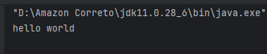

# Laporan Modul 1: Perkenalan Java dan Ekosistemnya
**Mata Kuliah:** Praktikum Pemrograman Berorientasi Objek   
**Nama:** Fathan Al Ghifari  
**NIM:** 2024573010091  
**Kelas:** TI 2A

---

## Abstrak
pada laporan pratikum kali ini bertujuan untuk mengenalkan dan mengsetup inteleij untuk mempelajari Pemograman Berbasis Objek  
Pemrograman Berbasis Objek (OOP) adalah paradigma pemrograman yang mengorganisir kode dalam bentuk objek yang memiliki atribut (properties) sebagai karakteristik atau data yang dimiliki objek, serta method (behavior) sebagai tindakan atau fungsi yang dapat dilakukan objek. Paradigma ini memberikan berbagai keuntungan signifikan dalam pengembangan software modern.

---

## 1. Pendahuluan
Java dipilih sebagai bahasa pemrograman dalam mata kuliah ini karena berbagai keunggulan yang dimilikinya. Platform independence merupakan fitur unggulan Java dengan konsep "Write once, run anywhere" yang memungkinkan program Java yang telah dikompilasi dapat dijalankan di berbagai sistem operasi tanpa perlu modifikasi kode. Java juga merupakan strongly typed language yang mengurangi kemungkinan error saat runtime karena sistem type checking yang ketat pada saat kompilasi.

---

## 2. Proses instalasi Java  
dimulai dengan menginstal JDK 21 (Amazon correto) sebagai JDK(Java Developent Kit)  
## langkah 1: akses Website Amazon Corretto
   - Buka browser web (Chrome, Firefox, atau Edge)
   - Navigasikan ke alamat: https://aws.amazon.com/corretto/
   - Klik tombol "Download Amazon Corretto" yang terletak di bagian tengah halaman
   - Anda akan diarahkan ke halaman download yang menampilkan berbagai versi yang tersedia  
## langkah 2:pilih versi JDK yang tepat  
1. Pada halaman download, pilih Amazon Corretto 17 atau Amazon Corretto 21 (keduanya adalah Long Term Support version)
2. Untuk pembelajaran pemula, Corretto 17 sangat direkomendasikan karena stabilitas dan compatibility yang baik
3. Pastikan Anda memilih versi yang sesuai dengan arsitektur sistem operasi:
   - Windows x64: Untuk Windows 64-bit (paling umum)
   - Windows x86: Untuk Windows 32-bit (jarang digunakan)
   - macOS x64: Untuk Mac dengan processor Intel
   - macOS aarch64: Untuk Mac dengan Apple Silicon (M1/M2)
   - Linux x64: Untuk distribusi Linux 64-bit
## langkah 3: Download Installer
1. Klik pada link download yang sesuai dengan sistem operasi Anda
2. Pilih format installer:
   - Windows: File dengan ekstensi .msi (Microsoft Installer)
   - macOS: File dengan ekstensi .pkg (Package Installer)
   - Linux: File dengan ekstensi .deb (untuk Ubuntu/Debian) atau .rpm (untuk RedHat/CentOS)
3. Tunggu proses download selesai (ukuran file sekitar 200-300 MB)
4. Pastikan lokasi download mudah diakses (biasanya folder Downloads)
## langkah 5: Verifikasi Instalasi
1. Windows: Buka Command Prompt dengan menekan Win+R, ketik cmd, tekan Enter
2. macOS: Buka Terminal dari Applications > Utilities > Terminal
3. Linux: Buka Terminal dengan Ctrl+Alt+T
4. Ketik command berikut dan tekan Enter:
```declarative
java -version
```
5. Output yang diharapkan akan menampilkan informasi seperti:
```declarative
openjdk version "17.0.x" 2023-xx-xx LTS
OpenJDK Runtime Environment Corretto-17.0.x.x (build 17.0.x+xx-LTS)
OpenJDK 64-Bit Server VM Corretto-17.0.x.x (build 17.0.x+xx-LTS, mixed mode, sharing)
```
6. Selanjutnya, verifikasi compiler dengan mengetik:
```declarative
javac -version
```
7. Output yang diharapkan:
```declarative
javac 17.0.x
```
## langkah 6: Setup Environment Variables (Khusus Windows)
1. Klik kanan pada "This PC" di desktop atau File Explorer, pilih "Properties"
2. Klik "Advanced system settings" di panel kiri
3. Pada dialog System Properties, klik "Environment Variables…"
4. Di bagian "System variables", klik "New…"
5. Masukkan:
   - Variable name: `JAVA_HOME`
   - Variable value: `C:\Program Files\Amazon Corretto\jdk17.0.x_xx` (sesuaikan dengan versi yang terinstall)
6. Klik "OK"
7. Cari variable "Path" di System variables, klik "Edit…"
8. Klik "New" dan tambahkan: %JAVA_HOME%\bin
9. Klik "OK" pada semua dialog yang terbuka
10. Restart Command Prompt untuk menerapkan perubahan
11. 
kemudian instal Intellj Idea CE
1. buka websites Jetbrains 
2. pastikan download jenis "community"
3. jalankan program yang baru di download\
4. pada saat awal membuka intellj akan muncul "Welcome to IntelliJ IDEA" Pada dialog "Import IntelliJ IDEA Settings", pilih "Do not import settings"
5. selanjutnya Verifikasi Konfigurasi JDK di IntelliJ IDEA
6. klik "new project"
7. di panel kiri, pilih "java"
8. pilih correto file correto yang sudah didownload

---

## 3. Laporan proses pembuatan program hello world dengan java
sebelum membuat program "hello" pastikan mempersiapkan repository
1. Install git jika belum ada (https://git-scm.com/)
2. Buatkan akun github (jika belum ada). https://github.com/
3. Buatkan sebuah repository baru dengan nama `praktikum-pbo-<nim anda>`. Jangan lupa checklist readme di klik, untuk membuat file `readme` di repo.
4. buka terminal pada intellj, ketik sebagai berikut:
```declarative
git init
git remote add origin https: <link repository>
git branch -M main
```
5. setelah sudah conect dengan github baru buat file dan folder baru dengan ketentuan berikut:
```declarative
praktikum-pbo/
├── .gitignore
├── README.md                  ← Biarkan kosong untuk sementara
├── laporan/
    ├── laporan1/          
        ├── laporan.md         ← Contoh laporan (format Markdown)
│       └── gambar/
│           └── gambar.png     ← Contoh gambar yang di masukkan ke dalam laporan
├── projects/                   ← placeholder untuk ujicoba praktikum
```
6. buat sebuah class java baru dan beri nama `main` 
7. tuliskan kode berikut:
```declarative
public class Main {
    public static void main(String[] args) {
        System.out.println("Hello World");
    }
}
```
hasil nya:  

---

## 4. Referensi
Amazon Correto: https://aws.amazon.com/corretto/
intellj : https://www.jetbrains.com/idea/

---
