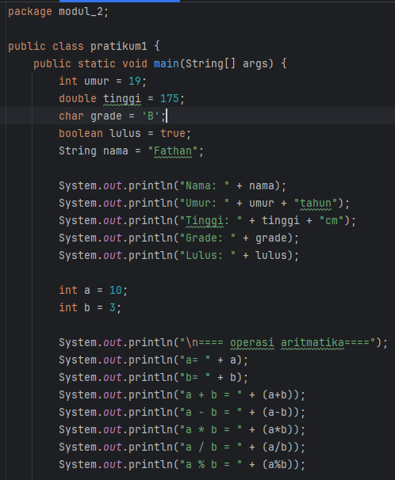

# Laporan Modul 2: Dasar Pemrograman Java
**Mata Kuliah:** Praktikum Pemrograman Berorientasi Objek   
**Nama:** Fathan Al Ghifari  
**NIM:** 2024573010091  
**Kelas:** TI 2A

---

## 1. Abstrak
isi laporan ini adalah untuk mempelajari dasar-dasar pemrograman menngunaka java dengan beberapa jenis pratikum yang akan dilakukan yaitu, mengetahui `variabel` dan `tipe data`,`input`,`output` dan `scanner`, `percabangan` dan `perulangan`
## 2. Praktikum
### Praktikum 1 - variable dan Tipe Data   
#### Dasar Teori 
Java memiliki dua kategori tipe data:

**Tipe Data Primitif**
byte: 8-bit signed integer (-128 to 127)  
- short: 16-bit signed integer (-32,768 to 32,767)  
- int: 32-bit signed integer (-2,147,483,648 to 2,147,483,647)  
- long: 64-bit signed integer  
- float: 32-bit IEEE 754 floating point  
- double: 64-bit IEEE 754 floating point  
- boolean: true atau false  
- char: 16-bit Unicode character

**Tipe Data Reference**  
- String, Array, Object, dll. 

**Aturan Penamaan Variabel**  
- Dimulai dengan huruf, underscore (_), atau dollar sign ($)  
- Tidak boleh dimulai dengan angka  
- Case sensitive
- Tidak boleh menggunakan keyword Java
#### Langkah Praktikum  
Langkah 1: Import dan Membuat Scanner

1. Buat file baru dengan nama `InputOutputDemo.java`   
2. Ketik kode berikut:  
  

#### Screenshoot Hasil

#### Analisa dan Pembahasan
pada pratikum pertama ini, kita mempelajari cara membuat variabel dan menampilkan nya, membuat aritmatika sederhana, casting tipe data

### Praktikum 2 - Input, Output dan Scanner
#### Dasar Teori
Untuk membaca input dari pengguna dalam Java, kita menggunakan class Scanner yang terdapat dalam package java.util. Scanner menyediakan berbagai method untuk membaca berbagai tipe data:  

- nextInt(): membaca integer
- nextDouble(): membaca double
- nextLine(): membaca String (termasuk spasi)
- next(): membaca String (sampai spasi pertama)
- nextBoolean(): membaca boolean
#### Langkah Praktikum
Langkah 1: Import dan Membuat Scanner

1. Buat file baru dengan nama `InputOutputDemo.java`
2. Ketik kode berikut:  

#### Screenshoot Hasil

#### Analisa dan Pembahasan
pada pratikum kedua ini, kita menngunakan scanner untuk menerima input dari user dan menampilkan nya ke layar, syntax yang digunakan untuk menerima input berbeda-beda tergantung tipe data yang akan digunakan
### Praktikum 3 - Struktur Control: Percabangan
#### Dasar Teori 
Struktur kontrol percabangan digunakan untuk membuat keputusan dalam program. Java menyediakan beberapa statement percabangan:  
1. if statement
>if (kondisi) {  
   // kode yang dijalankan jika kondisi true  
   }
2. If-Else Statement
>if (kondisi) {  
// kode jika kondisi true  
} else {  
// kode jika kondisi false  
}
3. If-Else If-Else Statement
>if (kondisi1) {  
// kode jika kondisi1 true  
} else if (kondisi2) {  
// kode jika kondisi2 true  
} else {  
// kode jika semua kondisi false  
}
4. Switch Statement
>switch (variabel) {  
case nilai1:  
// kode  
break;  
case nilai2:  
// kode  
break;  
default:  
// kode default  
}

#### Langkah Praktikum
Langkah 1: Program Penentu Grade
1. Buat file baru dengan nama `GradeDemo.java`
2. Implementasikan kode berikut:    
  

#### Screenshoot Hasil
  
Langkah 2: Program Menu dengan Switch
1. Buat file baru dengan nama `MenuDemo.java`    
2. Implementasikan kode berikut:  
  

#### Hasil
  
Langkah 3: Program Nested If

1. Buat file baru dengan nama `NestedIfDemo.java`  
2. Implementasikan program untuk menentukan kategori usia:  

#### hasil  

#### Analisa dan Pembahasan
pada pratikum ketiga ini kita mempelajari tentang penggunan if (percabangan) yang digunakan untuk membuat pilihan  
implementasi yang percabangan pada pratikum ini ada berupa program menentukan Grade, pilihan menu untuk menghitung luas persegi,segitiga dan lingkaran dan menentukan kategori berdasarkan input umur 

### Praktikum 4 - Struktur Control: Perulangan
#### Dasar Teori
Perulangan (loop) digunakan untuk mengulang eksekusi kode tertentu. Java menyediakan tiga jenis perulangan:  
1. For Loop:  
>for (inisialisasi; kondisi; increment/decrement) {  
// kode yang diulang  
}
2. While Loop:  
>while (kondisi) {  
// kode yang diulang  
}
3. Do-While Loop:  
>do {  
// kode yang diulang  
} while (kondisi);  

#### Langkah Praktikum
Langkah 1: Perulangan For

1. Buat file baru dengan nama `ForLoopDemo.java`  
2. Implementasikan berbagai contoh for loop:  

#### Screenshoot Hasil
  
Langkah 2: Perulangan While dan Do-While

1. Buat file baru dengan nama `WhileLoopDemo.java`
2. Implementasikan contoh while dan do-while:  
  

#### hasil
  
Langkah 3: Nested Loop (Perulangan Bersarang)

1. Buat file baru dengan nama `NestedLoopDemo.java`
2. Implementasikan contoh nested loop:  

#### hasil

#### Analisa dan Pembahasan
pada pratikum keempat ini kita mempelajari tentang penggunaan Loop di sebuah program mulai dari for, while dan do while  
implementasi dari penggunaan Loop tersebut adalah menampilkan angka 1-10, genap 2-20, countdown dan tabel perkalian 5 menngunakan for
tebak angka menngunakan while  
dan membuat pola segitiga menggunakan nested Loop

---

## 3. Kesimpulan

Setelah menyelesaikan pratikum ini,saya dapat membuat beberapa program sederhana menyangkut variabel dan tipe data,input,output dan scanner, percabangan dan perulangan menggunakan Java

---

## 4. Referensi
- https://www.w3schools.com/java
- https://www.petanikode.com/tutorial/java/

---
