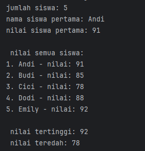
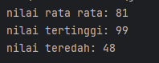
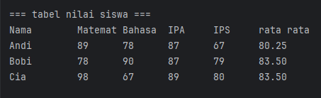
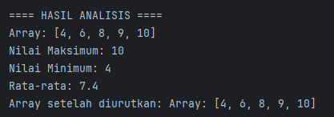
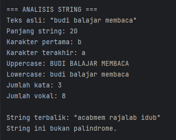
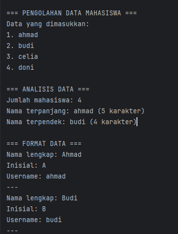

# Laporan Modul 3: Dasar Pemrograman Java Lanjutan
**Mata Kuliah:** Dasar Pemrograman Java Lanjutan  
**Nama:** Fathan Al Ghifari  
**NIM:** 2024573010091  
**Kelas:** TI 2A

---

## 1. Abstrak
Modul ini dirancang untuk memberikan pemahaman dasar tentang pemrograman Java melalui praktikum langsung. Setiap praktikum dilengkapi dengan teori dasar dan langkah-langkah implementasi yang detail.
## 2. Teori Dasar
### 1. Array
Array adalah struktur data yang dapat menyimpan beberapa nilai dengan tipe data yang sama dalam satu variabel. Array menggunakan indeks untuk mengakses elemen-elemennya, dimulai dari indeks 0.

Karakteristik Array:  
- Semua elemen memiliki tipe data yang sama
- Ukuran array bersifat tetap (fixed size)
- Indeks dimulai dari 0
- Elemen dapat diakses secara langsung menggunakan indeks

Syntax Array:  
```declarative
// Deklarasi array
tipeData[] namaArray = new tipeData[ukuran];

// Atau inisialisasi langsung
tipeData[] namaArray = {nilai1, nilai2, nilai3, ...};

```
### Praktikum 1.1: Array Satu Dimensi
1. Buat file baru dengan nama `ArraySatuDimensi.java`
2. Ketik kode berikut:
```declarative
public class ArraySatuDimensi {
    public static void main(String[] args){
        int[] nilai = {91, 85, 78, 88, 92};
        String[] nama = {"Andi", "Budi", "Cici", "Dodi", "Emily"};
        int tertinggi = nilai[0];
        int terendah = nilai[0];

        System.out.println("jumlah siswa: " + nama.length);

        System.out.println("nama siswa pertama: " + nama[0]);
        System.out.println("nilai siswa pertama: " + nilai[0]);

        System.out.println("\n nilai semua siswa:");
        for(int i = 0; i < nama.length; i++){
            System.out.println((i+1) + ". " + nama[i] + " - nilai: " + nilai[i]);
        }

        for(int i = 1; i < nilai.length;i++){
            if(nilai[i] > tertinggi){
                tertinggi = nilai[i];
            }
            if(nilai[i] < terendah){
                terendah = nilai[i];
            }
        }
        System.out.println("\n nilai tertinggi: " + tertinggi);
        System.out.println(" nilai teredah: " + terendah);
    }
}
```
hasil:


### Tugas Pratikum 1.1
```declarative
package modul_3.latihan;

public class latihan1 {
    public static void main(String[] args){
        int[] nilai = {89, 90, 72, 67, 48, 82, 83, 99, 92, 70};
        int rata_rata;
        int sementara = 0;
        int tertingi = nilai[0];
        int terendah = nilai[0];

        for(int i = 0;i < nilai.length;i+=2){
            sementara = nilai[i] + nilai[i+1];
        }
        rata_rata = sementara / 2;
        for(int i = 1; i < nilai.length;i++){
            if(nilai[i] > tertingi){
                tertingi = nilai[i];
            }
            if(nilai[i] < terendah){
                terendah = nilai[i];
            }

        }
        System.out.println("nilai rata rata: " + rata_rata);
        System.out.println("nilai tertinggi: " + tertingi);
        System.out.println("nilai teredah: " + terendah);

    }
}

```
hasil:


###  Praktikum 1.2: Array Dua Dimensi
1. Buat file baru dengan nama `ArrayDuaDimensi.java`
2. Implementasikan kode berikut:
```declarative
package modul_3;

import java.util.Scanner;

public class ArrayDuaDimensi {
    public static void main(String[] args){
        Scanner input = new Scanner(System.in);
        int[][] nilaiSiswa =  new int[3][4];
        String[] namaSiswa = {"Andi", "Bobi", "Cia"};
        String[] mataPelajaran = {"Matematika", "Bahasa Indonesia", "IPA", "IPS"};

        System.out.println("=== input nilai siswa ===");
        for(int i = 0; i<3;i++){
            System.out.println("input nilai untuk " + namaSiswa[i] + ": ");
            for(int j = 0; j<4;j++){
                System.out.print(mataPelajaran[j] + ":");
                nilaiSiswa[i][j] = input.nextInt();
            }
            System.out.println();
        }

        System.out.println("=== tabel nilai siswa ===");
        System.out.printf("%-12s", "Nama");
        for(String mapel : mataPelajaran){
            System.out.printf("%-8s", mapel.substring(0, Math.min(7, mapel.length())));
        }
        System.out.println("rata rata");

        for(int i = 0 ;i<3;i++){
            System.out.printf("%-12s", namaSiswa[i]);
            int total = 0;
            for(int j = 0; j<4;j++){
                System.out.printf("%-8s", nilaiSiswa[i][j]);
                total += nilaiSiswa[i][j];
            }
            Double rataRata = total / 4.0;
            System.out.printf("%.2f\n", rataRata);
        }

    }
}

```
hasil:


### Praktikum 2.2: Method Dengan Array
Memahami cara menggunakan method untuk memproses array.
1. Buat file baru dengan nama `ArrayMethod.java`
2. Ketik kode berikut:
```declarative
package modul_3;
import java.util.Scanner;

public class arrayMethod {

    // Method untuk input array
    public static int[] inputArray(int ukuran) {
        Scanner input = new Scanner(System.in);
        int[] array = new int[ukuran];
        System.out.println("Masukkan " + ukuran + " angka:");
        for (int i = 0; i < ukuran; i++) {
            System.out.print("Angka ke-" + (i + 1) + ": ");
            array[i] = input.nextInt();
        }
        return array;
    }

    // Method untuk menampilkan array
    public static void tampilkanArray(int[] array) {
        System.out.print("Array: [");
        for (int i = 0; i < array.length; i++) {
            System.out.print(array[i]);
            if (i < array.length - 1)
                System.out.print(", ");
        }
        System.out.println("]");
    }

    // Method untuk mencari nilai maksimum (Dikonstruksi berdasarkan potongan dan fungsi)
    public static int cariMaksimum(int[] array) {
        int maks = array[0];
        for (int i = 1; i < array.length; i++) {
            if (array[i] > maks) {
                maks = array[i];
            }
        }
        return maks;
    }

    // Method untuk mencari nilai minimum (Dikonstruksi berdasarkan deskripsi praktikum)
    public static int cariMinimum(int[] array) {
        int min = array[0];
        for (int i = 1; i < array.length; i++) {
            if (array[i] < min) {
                min = array[i];
            }
        }
        return min;
    }

    // Method untuk menghitung rata-rata (Dikonstruksi berdasarkan potongan)
    public static double hitungRataRata(int[] array) {
        int total = 0;
        for (int nilai : array) {
            total += nilai;
        }
        return (double) total / array.length;
    }

    // Method untuk mengurutkan array (Bubble Sort)
    public static int[] urutkanArray(int[] array) {
        int[] arrayBaru = array.clone(); // Membuat copy array
        for (int i = 0; i < arrayBaru.length - 1; i++) {
            for (int j = 0; j < arrayBaru.length - 1 - i; j++) {
                if (arrayBaru[j] > arrayBaru[j + 1]) {
                    // Tukar posisi
                    int temp = arrayBaru[j];
                    arrayBaru[j] = arrayBaru[j + 1];
                    arrayBaru[j + 1] = temp;
                }
            }
        }
        return arrayBaru;
    }

    public static void main(String[] args) {
        System.out.println("==== PROGRAM ANALISIS ARRAY ====");
        int[] data = inputArray(5);

        System.out.println("\n==== HASIL ANALISIS ====");
        tampilkanArray(data);
        System.out.println("Nilai Maksimum: " + cariMaksimum(data));
        System.out.println("Nilai Minimum: " + cariMinimum(data));
        System.out.println("Rata-rata: " + hitungRataRata(data));

        int[] dataTerurut = urutkanArray(data);
        System.out.print("Array setelah diurutkan: ");
        tampilkanArray(dataTerurut);
    }
}
```
hasil:


### 3. String dan Manipulasi String
#### Teori Dasar
String adalah tipe data yang menyimpan rangkaian karakter. Di Java, String adalah object yang memiliki banyak method built-in untuk manipulasi teks.

Karakteristik String di Java:
- String bersifat immutable (tidak dapat diubah)
- Setiap operasi String menghasilkan String baru
- Java menyediakan banyak method untuk manipulasi String
Method String yang Penting:
`length()`: mendapatkan panjang string
`charAt()`: mendapatkan karakter pada indeks tertentu
`substring()`: mengambil bagian string
`toLowerCase()` / `toUpperCase()`: mengubah case
`contains()`: mengecek apakah string mengandung substring
`replace()`: mengganti karakter/substring

### Praktikum 3.1: Manipulasi String Dasar
Memahami berbagai method manipulasi string dan penggunaannya.

1. Buat file baru dengan nama `StringDasar.java`
2. Ketik kode berikut:
```declarative
package modul_3;
import java.util.Scanner;

public class stringDasar {

    public static void analisisString(String teks) {
        System.out.println("\n=== ANALISIS STRING ===");
        System.out.println("Teks asli: \"" + teks + "\"");
        System.out.println("Panjang string: " + teks.length());
        System.out.println("Karakter pertama: " + teks.charAt(0));
        System.out.println("Karakter terakhir: " + teks.charAt(teks.length() - 1));
        System.out.println("Uppercase: " + teks.toUpperCase());
        System.out.println("Lowercase: " + teks.toLowerCase());

        String[] kata = teks.trim().split("\\s+");
        System.out.println("Jumlah kata: " + kata.length);

        int jumlahVokal = hitungVokal(teks);
        System.out.println("Jumlah vokal: " + jumlahVokal);
        // Method hitungKonsonan() seharusnya dipanggil di sini juga
    }

    public static int hitungVokal(String teks) {
        String vokal = "aeiouAEIOU";
        int count = 0;
        for (int i = 0; i < teks.length(); i++) {
            // Logika disimpulkan dari fungsionalitas
            if (vokal.contains(String.valueOf(teks.charAt(i)))) {
                count++;
            }
        }
        return count;
    }

    // Method untuk membalik string (Dikonstruksi)
    public static String reverseString(String teks) {
        return new StringBuilder(teks).reverse().toString();
    }

    // Method untuk cek palindrome (Dikonstruksi)
    public static boolean isPalindrome(String teks) {
        // Membersihkan string dari spasi/simbol dan mengubah ke lowercase untuk perbandingan
        String cleanTeks = teks.replaceAll("[^a-zA-Z0-9]", "").toLowerCase();
        String reversed = new StringBuilder(cleanTeks).reverse().toString();
        return cleanTeks.equals(reversed);
    }

    public static void main(String[] args) {
        Scanner input = new Scanner(System.in);
        System.out.print("Masukkan sebuah kalimat: ");
        String kalimat = input.nextLine();

        // Analisis dasar
        analisisString(kalimat);

        // String terbalik
        System.out.println("\nString terbalik: \"" + reverseString(kalimat) + "\"");

        // Cek palindrome
        if (isPalindrome(kalimat)) {
            System.out.println("String ini adalah palindrome!");
        } else {
            System.out.println("String ini bukan palindrome.");
        }

        // Pencarian substring
        System.out.print("\nMasukkan kata yang ingin dicari: ");
        String cari = input.nextLine();

        if (kalimat.toLowerCase().contains(cari.toLowerCase())) {
            System.out.println("Kata \"" + cari + "\" ditemukan dalam kalimat.");
            int posisi = kalimat.toLowerCase().indexOf(cari.toLowerCase());
            System.out.println("Posisi pertama: " + posisi);
        } else {
            System.out.println("Kata \"" + cari + "\" tidak ditemukan dalam kalimat.");
        }
    }
}
```
hasil:


### Praktikum 3.2: Pengolahan Data Text
Memahami penggunaan string untuk pengolahan data dalam format teks.

1. Buat file baru dengan nama `TextProcessing.java`
2. Ketik kode berikut:
```declarative
package modul_3;
import java.util.Scanner;

public class textProccesing {

    public static void prosesDataMahasiswa(String data) {
        System.out.println("\n=== PENGOLAHAN DATA MAHASISWA ===");
        // Memisahkan data berdasarkan koma
        String[] dataMahasiswa = data.split(",");

        System.out.println("Data yang dimasukkan:");
        for (int i = 0; i < dataMahasiswa.length; i++) {
            dataMahasiswa[i] = dataMahasiswa[i].trim();
            System.out.println((i + 1) + ". " + dataMahasiswa[i]);
        }

        // Analisis data
        System.out.println("\n=== ANALISIS DATA ===");
        System.out.println("Jumlah mahasiswa: " + dataMahasiswa.length);

        // Mencari nama terpanjang dan terpendek
        String namaTerpanjang = dataMahasiswa[0];
        String namaTerpendek = dataMahasiswa[0];

        for (String nama : dataMahasiswa) {
            if (nama.length() > namaTerpanjang.length()) {
                namaTerpanjang = nama;
            }
            if (nama.length() < namaTerpendek.length()) {
                namaTerpendek = nama;
            }
        }
        // Output Analisis (Dikonstruksi berdasarkan hasil screenshot)
        System.out.println("Nama terpanjang: " + namaTerpanjang + " (" + namaTerpanjang.length() + " karakter)");
        System.out.println("Nama terpendek: " + namaTerpendek + " (" + namaTerpendek.length() + " karakter)");

        System.out.println("\n=== FORMAT DATA ===");
        for (String nama : dataMahasiswa) {
            String namaFormatted = formatTitleCase(nama);
            String inisial = buatInisial(namaFormatted);

            System.out.println("Nama lengkap: " + namaFormatted);
            System.out.println("Inisial: " + inisial);
            System.out.println("Username: " + buatUsername(namaFormatted));
            System.out.println("---");
        }
    }

    public static String formatTitleCase(String teks) {
        String[] kata = teks.toLowerCase().split(" ");
        StringBuilder result = new StringBuilder();

        for (String k : kata) {
            if (k.length() > 0) {
                result.append(Character.toUpperCase(k.charAt(0)))
                        .append(k.substring(1))
                        .append(" ");
            }
        }
        return result.toString().trim();
    }

    public static String buatInisial(String nama) {
        String[] kata = nama.split(" ");
        StringBuilder inisial = new StringBuilder();

        for (String k : kata) {
            if (k.length() > 0) {
                inisial.append(Character.toUpperCase(k.charAt(0)));
            }
        }
        return inisial.toString();
    }

    // Method untuk membuat username (Dikonstruksi berdasarkan hasil screenshot)
    public static String buatUsername(String nama) {
        // Mengambil kata pertama dan mengubahnya menjadi huruf kecil
        String[] kata = nama.split(" ");
        return kata[0].toLowerCase();
    }

    public static void main(String[] args) {
        Scanner input = new Scanner(System.in);
        System.out.println("Contoh: Alice Johnson, Bob Smith, CHARLIE BROWN");
        System.out.print("Masukkan daftar nama (dipisahkan koma): ");
        String dataInput = input.nextLine();
        prosesDataMahasiswa(dataInput);
    }
}
```
hasil:

---

## 3. Kesimpulan
pemahaman dasar tentang pemrograman Java melalui praktikum langsung. Setiap praktikum dilengkapi dengan teori dasar dan langkah-langkah implementasi yang detail.

---

## 4. Referensi
- https://www.w3schools.com/java
- https://www.petanikode.com/tutorial/java/

---
