# Laporan Modul 5: Enkapsulasi
**Mata Kuliah:** Praktikum Pemrograman Berorientasi Objek   
**Nama:** Fathan Al Ghifari  
**NIM:** 2024573010091  
**Kelas:** TI 2A

---

## Abstrak
Encapsulation (Enkapsulasi) adalah salah satu prinsip fundamental dalam Object-Oriented Programming (OOP) yang membungkus data (attributes) dan method yang bekerja pada data tersebut dalam satu unit (class), serta menyembunyikan detail implementasi internal dari dunia luar.  
**Tujuan Encapsulation**  
1. Data Protection - Melindungi data dari akses dan modifikasi yang tidak sah.
2. Data Validation - Memastikan data yang masuk valid sebelum disimpan.
3. Flexibility - Mudah mengubah implementasi internal tanpa mempengaruhi kode luar.
4. Maintainability - Kode lebih mudah dipelihara dan di-debug.
5. Modularity - Membuat kode lebih modular dan terorganisir

**Prinsip Utama**  
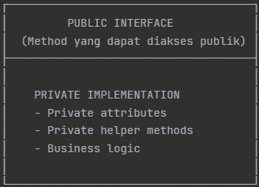

**Cara Implementasi**  
1. Deklarasikan attributes sebagai private.
2. Buat getter methods untuk membaca nilai attributes.
3. Buat setter methods untuk mengubah nilai attributes dengan validasi.
4. Tambahkan business logic di dalam class.  
**Access Modifier:**  
Access modifier menentukan tingkat akses terhadap class, attributes, dan methods. Java memiliki 4 jenis access modifier:
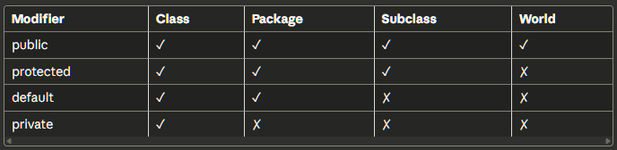
---

## Pratikum 1: Memahami Access Modifier
###### Tujuan:  
Memahami perbedaan dan penggunaan berbagai access modifier.

1. Buat sebuah package baru di dalam package `modul_5` dengan nama `praktikum_1`
2. Buat class baru bernama `Person` dengan berbagai access modifier
```declarative
package modul_5.pratikum_1;

public class Person {
    private String nama;
    private int umur;

    String alamat;

    protected  String telepon;

    public String email;

    public Person(String nama, int umur){
        this.nama = nama;
        this.umur = umur;
    }

    public void tampilkanInfpo() {
        System.out.println("INFORMASI PERSON");
        System.out.println("Nama: " + nama);
        System.out.println("Umur: " + umur);
        System.out.println("Alamat: " + alamat);
        System.out.println("Telepon: " + telepon);
        System.out.println("Email: " + email);
    }

    private void metodePribadi(){
        System.out.println("ini adalah method pribadi");
    }

    protected void metodeProtected(){
        System.out.println("ini adalah method protected");
    }

    public void panggilMetodePribadi(){
        metodePribadi();
    }

}


```
3. Buat class `AccessModifierTest` untuk testing:
```declarative
package modul_5.pratikum_1;


public class AccessModifierTest {
    public static void main(String[] args){
        Person person = new Person("Budiono Siregar",25);

        person.email = "Budiono342@gmail.com";
        System.out.println("Email: " + person.email);

        person.alamat = "jl. kenangan";
        System.out.println("Alamat: " + person.alamat);

        person.telepon = "0862939262322";
        System.out.println("Telepon: " + person.telepon);

        person.tampilkanInfpo();

        person.panggilMetodePribadi();

        System.out.println("\n DEMONSTRASI ACCESS MODIFIER");
        System.out.println("Y Public    : Bisa Diakses");
        System.out.println("Y Default    : Bisa Diakses (dalam package yang sama)");
        System.out.println("Y Protected    : Bisa Diakses (dalam package yang sama)");
        System.out.println("X Private     : TIDAK bisa diakases langsung");
    }
}

```
hasil:  
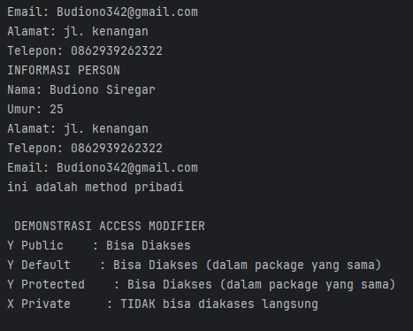
---

## Praktikum 2: Getter dan Setter
**Teori Dasar**  
Getter dan Setter adalah method yang digunakan untuk mengakses dan mengubah nilai private attributes.

**Naming Convention:**

- Getter: get + NamaAttribute (contoh: getNama())
- Setter: set + NamaAttribute (contoh: setNama())
- Boolean Getter: is + NamaAttribute (contoh: isActive())  

**Keuntungan Menggunakan Getter/Setter:**

- Kontrol akses terhadap data
- Validasi data sebelum disimpan
- Read-only atau write-only attributes
- Computed attributes
- Lazy initialization
**Tujuan:**
Memahami cara membuat dan menggunakan getter dan setter dengan benar.

Langkah-langkah:  
1. Buat sebuah package baru di dalam package `modul_5` dengan nama `praktikum_2`  
2. Buat class `Mahasiswa` dengan getter dan setter lengkap
```declarative
package modul_5.pratikum_2;

public class Mahasiswa {
    private String npm;
    private String name;
    private String jurusan;
    private double ipk;
    private int semester;
    private boolean aktif;

    // Constructor
    public Mahasiswa(String npm, String name, String jurusan) {
        this.npm = npm;
        this.name = name;
        this.jurusan = jurusan;
        this.ipk = 0.0;
        this.semester = 1;
        this.aktif = true;
    }

    // Getters

    public String getNpm() {
        return npm;
    }

    public String getName() {
        return name;
    }

    public String getJurusan() {
        return jurusan;
    }

    public double getIpk() {
        return ipk;
    }

    public int getSemester() {
        return semester;
    }

    // Cek status keaktifan. "is" prefix
    public boolean isAktif() {
        return aktif;
    }

    // Setter Methods (dengan validasi)

    // Untuk npm, biasanya tidak ada setter
    // Karena npm adalah unique key dan jarang diubah

    public void setName(String name) {
        // Validasi: nama tidak boleh kosong, berisi huruf, dan diawali huruf kapital
        if (name == null || name.trim().isEmpty() || !name.matches("^[A-Z][a-zA-Z\\s]*$")) {
            System.out.println("Nama tidak valid! Pastikan tidak kosong, hanya berisi huruf dan spasi, dan diawali huruf kapital.");
            return;
        }

        // Validasi: Nama hanya huruf dan spasi
        if (!name.matches("[a-zA-Z\\s]+")) {
            System.out.println("Nama harus hanya berisi huruf dan spasi!");
            return;
        }

        // Jika Nama valid
        this.name = name;
        System.out.println("Nama berhasil diubah menjadi: " + name);
    }

    public void setJurusan(String jurusan) {
        // Validasi: Jurusan tidak boleh kosong
        if (jurusan == null || jurusan.trim().isEmpty()) {
            System.out.println("Jurusan tidak boleh kosong!");
            return;
        }

        this.jurusan = jurusan;
        System.out.println("Jurusan berhasil diubah menjadi: " + jurusan);
    }

    public void setIpk(double ipk) {
        // Validasi: IPK harus antara 0.0 sampai 4.0
        if (ipk < 0.0 || ipk > 4.0) {
            System.out.println("IPK harus antara 0.0 - 4.0!");
            return;
        }

        this.ipk = ipk;
        System.out.printf("IPK berhasil diubah menjadi: %.2f%n", ipk);

        // Cek status aktif berdasarkan IPK
        this.aktif = (ipk >= 2.0); // Asumsi: minimal IPK 2.0 untuk aktif
    }

    public void setSemester(int semester) {
        // Validasi: Semester harus > 0 dan reasonable (misal: max 14)
        if (semester < 1 || semester > 14) {
            System.out.println("Semester harus antara 1 - 14!");
            return;
        }

        this.semester = semester;
        System.out.println("Semester berhasil diubah menjadi: " + semester);
    }

    public void setAktif(boolean aktif) {
        this.aktif = aktif;
        System.out.println("Status keaktifan diubah.");
        System.out.println("Status Mahasiswa: " + (aktif ? "AKTIF" : "TIDAK AKTIF"));
    }

    // Metode Tambahan (pencetak)

    // Metode untuk memberikan prediksi/deskripsi IPK
    public String getPredikat() {
        if (ipk >= 3.5) {
            return "Cum Laude (Sangat Baik)";
        } else if (ipk >= 3.0) {
            return "Sangat Memuaskan";
        } else if (ipk >= 2.0) {
            return "Memuaskan";
        } else {
            return "Kurang";
        }
    }

    // Metode untuk menampilkan info lengkap mahasiswa
    public void tampilkanInfo() {
        System.out.println("\n----------- INFORMASI MAHASISWA -----------");
        System.out.println("NPM       : " + npm);
        System.out.println("Nama      : " + name);
        System.out.println("Jurusan   : " + jurusan);
        System.out.printf("IPK       : %.2f (%s)%n", ipk, getPredikat());
        System.out.println("Semester  : " + semester);
        System.out.println("Status    : " + (aktif ? "AKTIF" : "TIDAK AKTIF"));
        System.out.println("-------------------------------------------");
    }
}

```
3. Buat class `GetterSetterTest`:
```declarative
package modul_5.pratikum_2;

public class GetterSetterTest {
    public static void main(String[] args) {
        System.out.println("TEST GETTER DAN SETTER\n");

        // Membuat object mahasiswa
        Mahasiswa mhs = new Mahasiswa("20230001", "Budi Santoso", "Teknik Informatika");
        System.out.println("--- Data Awal ---");
        mhs.tampilkanInfo();

        // Test GETTER
        System.out.println("\n--- TEST GETTER ---");
        System.out.println("Mengambil data menggunakan getter:");
        System.out.println("NPM    : " + mhs.getNpm());
        System.out.println("Nama   : " + mhs.getName());
        System.out.println("Jurusan: " + mhs.getJurusan());
        System.out.println("IPK    : " + mhs.getIpk());
        System.out.println("Semester: " + mhs.getSemester());
        System.out.println("Aktif  : " + mhs.isAktif());

        // Test SETTER dengan validasi
        System.out.println("\n--- TEST SETTER ---");

        // Test 1: Update IPK valid
        System.out.println("\n1. Update IPK (valid):");
        mhs.setIpk(3.75);

        // Test 2: Update IPK invalid
        System.out.println("\n2. Update IPK (invalid): // Akan ditolak");
        mhs.setIpk(5.0);

        // Test 3: Update nama valid
        System.out.println("\n3. Update Nama (valid):");
        mhs.setName("Ahmad Budi Santoso");

        // Test 4: Update nama invalid
        System.out.println("\n4. Update Nama (invalid - mengandung angka): // Akan ditolak");
        mhs.setName("Budi23");

        // Test 5: Update semester
        System.out.println("\n5. Update Semester:");
        mhs.setSemester(5);

        // Test 6: Update semester invalid
        System.out.println("\n6. Update Semester (invalid): // Akan ditolak");
        mhs.setSemester(20);

        // Test 7: Update status
        System.out.println("\n7. Update Status:");
        mhs.setAktif(false);

        // Tampilkan data akhir
        System.out.println("\n--- Data Setelah Update ---");
        mhs.tampilkanInfo();

        // Demonstrasi computed property
        System.out.println("\n--- COMPUTED PROPERTY ---");
        System.out.println("Predikat: " + mhs.getPredikat());

        // Tidak bisa akses langsung (akan error)
        System.out.println("\n(CATATAN ENCAPSULATION):");
        System.out.println("X TIDAK BISA: mhs.npm = \"123\";");
        System.out.println("X TIDAK BISA: mhs.ipk = 5.0;");
        System.out.println("X HANYA BISA: mhs.setIpk(5.0);");
        System.out.println("✓ VALIDASI otomatis dilakukan di setter!");
    }
}

```
hasil:  
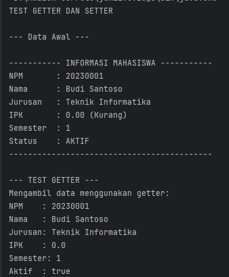  
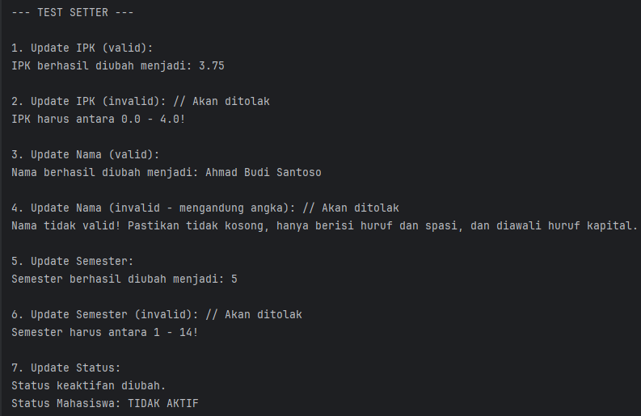  
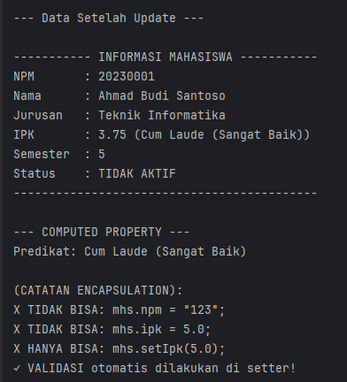  
## Praktikum 3: Read-Only dan Write-Only Properties
**Tujuan:**  
Memahami konsep read-only dan write-only properties menggunakan getter/setter.

**Langkah-langkah:**  
1. Buat sebuah package baru di dalam package `modul_5` dengan nama `praktikum_3`
2. Buat class `Product` dengan berbagai jenis properties:
```declarative
package modul_5.pratikum_3;

import java.time.LocalDateTime;
import java.time.format.DateTimeFormatter;

public class Product {


    //  Read-only property (hanya getter)
    private final String productId;
    private final LocalDateTime createdAt;

    //  Read-write property (punya getter dan setter)
    private String name;
    private double harga;
    private int stok;

    //  Write-only (hanya setter) – untuk keamanan PIN admin
    private String adminPin;

    //  Counter untuk ID otomatis
    private static int counter = 1000;

    //  CONSTRUCTOR

    public Product(String nama, double harga, int stok, String adminPin) {
        this.productId = generateProductId();
        this.createdAt = LocalDateTime.now();
        this.name = nama;
        this.harga = harga;
        this.stok = stok;
        this.adminPin = adminPin;
    }

    //  PRIVATE HELPER METHODS

    private String generateProductId() {
        counter++;
        return "PRD-" + counter;
    }

    private boolean validatePin(String inputPin) {
        return this.adminPin.equals(inputPin);
    }

    //  READ-ONLY PROPERTIES

    public String getProductId() {
        return productId;
    }

    public String getCreatedAt() {
        DateTimeFormatter formatter = DateTimeFormatter.ofPattern("dd-MM-yyyy HH:mm:ss");
        return createdAt.format(formatter);
    }

    //  READ-WRITE PROPERTIES

    public String getNama() {
        return name;
    }

    public void setNama(String nama, String pin) {
        if (!validatePin(pin)) {
            System.out.println("X PIN salah! Gagal mengubah nama.");
            return;
        }
        if (nama == null || nama.trim().isEmpty()) {
            System.out.println("X Nama produk tidak boleh kosong!");
            return;
        }
        this.name = nama;
        System.out.println("V Nama produk berhasil diubah.");
    }

    public double getHarga() {
        return harga;
    }

    public void setHarga(double harga, String pin) {
        if (!validatePin(pin)) {
            System.out.println("X PIN salah! Gagal mengubah harga.");
            return;
        }
        if (harga < 0) {
            System.out.println("X Harga tidak boleh negatif!");
            return;
        }
        this.harga = harga;
        System.out.printf("V Harga berhasil diubah menjadi Rp %.2f%n", harga);
    }

    public int getStok() {
        return stok;
    }

    public void setStok(int stok, String pin) {
        if (!validatePin(pin)) {
            System.out.println("X PIN salah! Gagal mengubah stok.");
            return;
        }
        if (stok < 0) {
            System.out.println("X Stok tidak boleh negatif!");
            return;
        }
        this.stok = stok;
        System.out.println("V Stok berhasil diubah menjadi " + stok);
    }


    //  WRITE-ONLY PROPERTY (PIN)

    public void changeAdminPin(String oldPin, String newPin) {
        if (!validatePin(oldPin)) {
            System.out.println("X PIN lama salah!");
            return;
        }
        if (newPin.length() < 4) {
            System.out.println("X PIN baru minimal 4 karakter!");
            return;
        }
        this.adminPin = newPin;
        System.out.println("V PIN berhasil diubah!");
    }


    //  COMPUTED PROPERTIES
    public double getTotalNilai() {
        return harga * stok;
    }

    public String getStatusStok() {
        if (stok == 0) return "HABIS";
        else if (stok < 10) return "MENIPIS";
        else if (stok < 50) return "TERSEDIA";
        else return "BANYAK";
    }

    //  PUBLIC METHODS
    public boolean tambahStok(int jumlah, String pin) {
        if (!validatePin(pin)) {
            System.out.println("X PIN salah!");
            return false;
        }
        if (jumlah <= 0) {
            System.out.println("X Jumlah harus lebih dari 0!");
            return false;
        }
        stok += jumlah;
        System.out.printf("V Stok ditambah %d. Stok sekarang: %d%n", jumlah, stok);
        return true;
    }

    public boolean kurangiStok(int jumlah, String pin) {
        if (!validatePin(pin)) {
            System.out.println("X PIN salah!");
            return false;
        }
        if (jumlah <= 0) {
            System.out.println("X Jumlah harus lebih dari 0!");
            return false;
        }
        if (jumlah > stok) {
            System.out.printf(" X Stok tidak cukup! Stok tersedia: %d%n", stok);
            return false;
        }
        stok -= jumlah;
        System.out.printf("V Stok dikurangi %d. Stok sekarang: %d%n", jumlah, stok);
        if (stok < 10) System.out.println(" Peringatan : Stok menipis !");
        return true;
    }


    //  DISPLAY INFO
    public void tampilkanInfo() {
        System.out.println("\n=== INFORMASI PRODUK ===");
        System.out.println("Product ID : " + productId);
        System.out.println("Nama       : " + name);
        System.out.println("Harga      : Rp " + harga);
        System.out.println("Stok       : " + stok + " (" + getStatusStok() + ")");
        System.out.println("Total Nilai: Rp " + getTotalNilai());
        System.out.println("Dibuat pada: " + getCreatedAt());
        System.out.println("=========================\n");
    }
}

```
3. Buat class `ProductTest` untuk testing:
```declarative
package modul_5.pratikum_3;

import java.util.Scanner;
public class ProductTest {
    public static void main(String[] args) {
        Scanner input = new Scanner(System.in);

        System.out.println("SISTEM MANAJEMEN PRODUK\n");

        //  Membuat dua produk dengan PIN admin
        Product laptop = new Product("Laptop ASUS", 8500000, 15, "1234");
        Product mouse = new Product("Mouse Logitech", 150000, 50, "1234");

        System.out.println("\nPRODUK BERHASIL DIBUAT");
        laptop.tampilkanInfo();
        mouse.tampilkanInfo();

        //  TEST READ-ONLY PROPERTIES

        System.out.println("TEST READ-ONLY PROPERTIES");
        System.out.println("Product ID (read-only): " + laptop.getProductId());
        System.out.println("Created At (read-only): " + laptop.getCreatedAt());
        System.out.println(" Properti ini TIDAK BISA diubah setelah dibuat\n");


        //  TEST READ-WRITE PROPERTIES

        System.out.println("TEST READ-WRITE PROPERTIES");

        // Test 1: Ubah harga tanpa PIN (akan gagal)
        System.out.println("\n1️. Mencoba ubah harga dengan PIN salah:");
        laptop.setHarga(9000000, "0000");

        // Test 2: Ubah harga dengan PIN benar
        System.out.println("\n2️. Ubah harga dengan PIN benar:");
        laptop.setHarga(9000000, "1234");

        // Test 3: Ubah nama
        System.out.println("\n3. Ubah nama produk:");
        laptop.setNama("Laptop ASUS ROG", "1234");

        // Test 4: Ubah stok
        System.out.println("\n 4.Ubah stok:");
        laptop.setStok(20, "1234");


        //  TEST WRITE-ONLY PROPERTY

        System.out.println("\nTEST WRITE-ONLY PROPERTY (PIN)");
        System.out.println("PIN tidak bisa dibaca (tidak ada getter).");
        System.out.println("Hanya bisa diubah dengan validasi PIN lama:");
        // Ubah PIN dengan benar
        laptop.changeAdminPin("1234", "5678");
        // Ubah PIN dengan salah (akan gagal)
        laptop.changeAdminPin("0000", "9999");


        //  TEST COMPUTED PROPERTIES

        System.out.println("\nTEST COMPUTED PROPERTIES");
        System.out.printf("Total Nilai Laptop : Rp %.2f%n", laptop.getTotalNilai());
        System.out.println("Status Stok Laptop : " + laptop.getStatusStok());
        System.out.printf("Total Nilai Mouse  : Rp %.2f%n", mouse.getTotalNilai());
        System.out.println("Status Stok Mouse  : " + mouse.getStatusStok());

        //  TEST BUSINESS METHODS

        System.out.println("\nTEST BUSINESS METHODS");

        // Tambah stok laptop
        System.out.println("\n 1. Tambah stok laptop:");
        laptop.tambahStok(10, "5678"); // PIN sudah diganti ke 5678

        // Kurangi stok mouse
        System.out.println("\n 2. Kurangi stok mouse (penjualan):");
        mouse.kurangiStok(45, "1234");

        // Kurangi stok mouse lagi hingga menipis
        System.out.println("\n 3. Kurangi stok mouse lagi (stok akan menipis):");
        mouse.kurangiStok(4, "1234");

        // Coba kurangi stok lebih dari yang tersedia
        System.out.println("\n 4. Coba kurangi stok lebih dari tersedia:");
        mouse.kurangiStok(10, "1234");


        //  TAMPILKAN INFO AKHIR

        System.out.println("\nINFORMASI PRODUK SETELAH UPDATE:");
        laptop.tampilkanInfo();
        mouse.tampilkanInfo();

        //  RINGKASAN ENCAPSULATION

        System.out.println("RINGKASAN ENCAPSULATION ");
        System.out.println("----------------------------");
        System.out.println("READ-ONLY  : productId, createdAt   (tidak bisa diubah)");
        System.out.println("READ-WRITE : name, harga, stok      (bisa diubah dengan PIN atau dengan Validasi)");
        System.out.println("WRITE-ONLY : adminPin               (tidak bisa dibaca)");
        System.out.println("COMPUTED   : totalNilai, statusStok (dihitung otomatis)");
    }
}

```
hasil:  
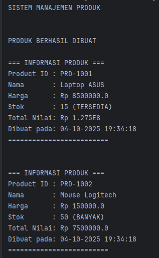  
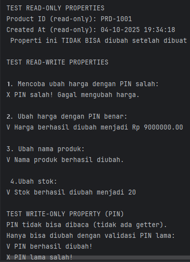  
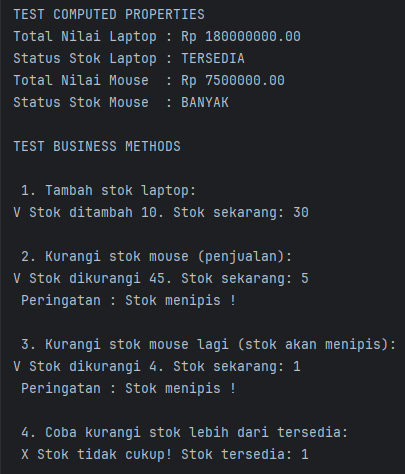  
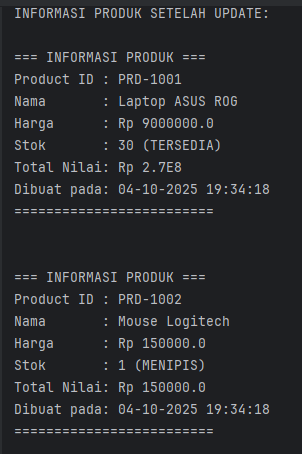  
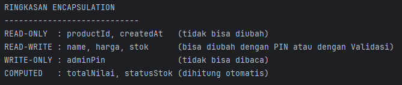  
---

## Referensi
- https://www.w3schools.com/java
- https://www.petanikode.com/tutorial/java/

---
