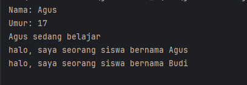
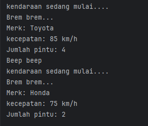
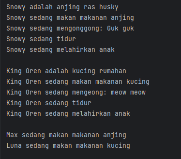
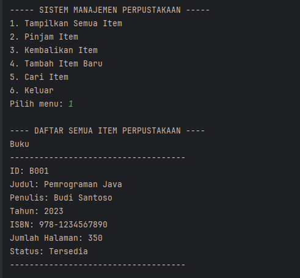
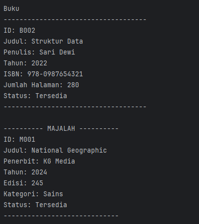
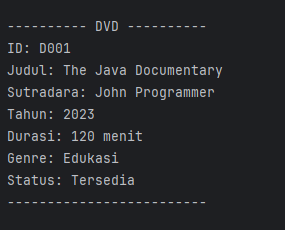

# Laporan Modul 5: Inheritance
**Mata Kuliah:** Praktikum Pemrograman Berorientasi Objek   
**Nama:** Fathan Al Ghifari  
**NIM:** 2024573010091  
**Kelas:** TI 2A

---

## Abstrak
Inheritance (Pewarisan) adalah salah satu prinsip fundamental dalam Object-Oriented Programming (OOP) yang memungkinkan sebuah class (subclass/child class) mewarisi sifat dan perilaku dari class lain (superclass/parent class). Dengan inheritance, kita dapat menghindari duplikasi kode dan meningkatkan reusability.

### Tujuan Inheritance
1. Code Reusability - Menggunakan kembali kode yang sudah ada tanpa menulis ulang.
2. Method Overriding - Memungkinkan subclass mengimplementasikan ulang method dari parent class.
3. Polymorphism - Memungkinkan objek subclass diperlakukan sebagai objek superclass.
4. Extensibility - Memperluas fungsionalitas class yang sudah ada.
5. Hierarchical Classification - Membuat hubungan hierarki antar class.

### Cara Implementasi
1. Gunakan kata kunci extends untuk mewarisi dari sebuah class.
2. Subclass dapat mengakses anggota (fields dan methods) yang bersifat protected dan public dari superclass.
3. Subclass dapat mengoverride method dari superclass.
4. Gunakan kata kunci super untuk mengakses anggota superclass.

### Jenis-jenis Inheritance:
**Single Inheritance**  
Single inheritance terjadi ketika sebuah class turunan hanya mewarisi dari satu class induk. Ini adalah bentuk pewarisan yang paling sederhana, di mana class turunan mendapatkan semua metode dan properti dari satu class induk saja.  
contoh:
```declarative
//Super class
class Vehicle {
    Vehicle() {
        System.out.println("This is a Vehicle");
    }
}

// Subclass 
class Car extends Vehicle {
    Car() {
        System.out.println("This Vehicle is Car");
    }
}

public class Test {
    public static void main(String[] args) {
        // Creating object of subclass invokes base class constructor
        Car obj = new Car();
    }
}

```
**Multiple Inheritance**  
Multiple inheritance memungkinkan sebuah class turunan untuk mewarisi dari lebih dari satu class induk. Artinya, class turunan dapat menggabungkan fungsionalitas dari beberapa class induk. Multiple inheritance lebih kompleks dan harus ditangani dengan hati-hati untuk menghindari masalah seperti diamond problem, di mana class turunan mewarisi dari dua class induk yang memiliki class dasar sama.  
contoh:
```declarative
interface LandVehicle {
    default void landInfo() {
        System.out.println("This is a LandVehicle");
    }
}
interface WaterVehicle {
    default void waterInfo() {
        System.out.println("This is a WaterVehicle");
    }
}
// Subclass implementing both interfaces
class AmphibiousVehicle implements LandVehicle, WaterVehicle {
    AmphibiousVehicle() {
        System.out.println("This is an AmphibiousVehicle");
    }
}
public class Test {
    public static void main(String[] args) {
        AmphibiousVehicle obj = new AmphibiousVehicle();
        obj.waterInfo();
        obj.landInfo();
    }
}

```
**Hierarchical Inheritance**  
Hierarchical inheritance terjadi saat beberapa class turunan mewarisi dari satu class induk yang sama. Jenis ini sering digunakan untuk mengelompokkan fungsionalitas yang serupa ke dalam satu class induk, sementara memungkinkan variasi dalam class turunan.  
contoh:
```declarative
class Vehicle {
    Vehicle() {
        System.out.println("This is a Vehicle");
    }
}

class Car extends Vehicle {
    Car() {
        System.out.println("This Vehicle is Car");
    }
}

class Bus extends Vehicle {
    Bus() {
        System.out.println("This Vehicle is Bus");
    }
}

public class Test {
    public static void main(String[] args) {
        Car obj1 = new Car(); 
        Bus obj2 = new Bus(); 
    }
}

```
**Multilevel Inheritance**  
Dalam multilevel inheritance, sebuah class turunan mewarisi dari class turunan lain, sementara class yang sendiri mewarisi dari class induk. Jenis ini menciptakan "rantai" pewarisan. Misalnya, class C mewarisi dari class B, dan class B mewarisi dari class A.  
contoh:
```declarative
class Vehicle {
    Vehicle() {
        System.out.println("This is a Vehicle");
    }
}
class FourWheeler extends Vehicle {
    FourWheeler() {
        System.out.println("4 Wheeler Vehicles");
    }
}
class Car extends FourWheeler {
    Car() {
        System.out.println("This 4 Wheeler Vehicle is a Car");
    }
}
public class Geeks {
    public static void main(String[] args) {
        Car obj = new Car(); // Triggers all constructors in order
    }
}

```

**Hybrid Inheritance**  
Hybrid inheritance adalah kombinasi dari dua atau lebih jenis inheritance yang sebelumnya sudah disebutkan di atas. Kondisi ini sering terjadi dalam sistem yang lebih kompleks, di mana berbagai bentuk inheritance dipakai bersama-sama untuk mencapai fleksibilitas dan efisiensi yang diinginkan.  

---

## Pratikum 1: Memahami Single Inheritance
###### Tujuan:
Memahami konsep dan implementasi single inheritance.

1. Buat sebuah package baru di dalam package `modul_6` dengan nama `praktikum_1`
2. Buat class baru bernama `Person` sebagai superclass:
```declarative
package modul_6.pratikum_1;

public class Person {
protected String nama;
protected int umur;

public Person(String nama, int umur){
this.nama = nama;
this.umur = umur;
}

public void displayInfo(){
System.out.println("Nama: " + nama);
System.out.println("Umur: " + umur);
}

public void greet(){
System.out.println("halo, aku adalah Person.");
}
}

```
3. Buat class `Student` sebagai subclass yang mewarisi `Person`:
```declarative
package modul_6.pratikum_1;

public class Student extends Person{
private String idSiswa;

public Student(String nama, int umur, String idSiswa){
super(nama,umur);
this.idSiswa = idSiswa;
}

public void belajar(){
System.out.println(nama + " sedang belajar");
}

@Override
public void greet(){
System.out.println("halo, saya seorang siswa bernama " + nama);
}
}


```
4. Buat class InheritanceTest untuk testing:
```declarative
package modul_6.pratikum_1;

public class InheritanceTest {
    public static void main(String[] args){
        Student student = new Student("Agus", 17,"S1234");

        student.displayInfo();

        student.belajar();

        student.greet();

        Person person = new Student("Budi", 18,"S1233");
        person.greet();
    }
}

```
hasil:  

---

## Praktikum 2: Method Overriding dan Kata Kunci `super`
**Teori Dasar**  
Method overriding memungkinkan subclass memberikan implementasi spesifik untuk method yang sudah didefinisikan di superclass. Kata kunci `super` digunakan untuk mengakses anggota superclass.  
Aturan Method Overriding:
1. Method harus memiliki nama dan parameter yang sama
2. Return type harus sama atau subtype (covariant return type)
3. Access modifier tidak boleh lebih restriktif
4. Tidak bisa override method yang final atau static  

Penggunaan super:
1. `super()` - Memanggil constructor superclass
2. `super.methodName()` - Memanggil method superclass
3. `super.variableName` - Mengakses variable superclass

Tujuan:
Memahami cara melakukan method overriding dan penggunaan kata kunci `super`.

Langkah-langkah:
1. Buat sebuah package baru di dalam package `modul_6` dengan nama `praktikum_2`
2. Buat class `Vehicle` sebagai superclass:
```declarative
package modul_6.pratikum_2;

public class Vehicle {
protected String merk;
protected int kecepatan;

public Vehicle(String merk,int kecepatan){
this.merk = merk;
this.kecepatan = kecepatan;
}

public void mulai(){
System.out.println("kendaraan sedang mulai....");
}

public void displayInfo(){
System.out.println("Merk: " + merk);
System.out.println("kecepatan: " + kecepatan + " km/h");
}
}


```
3. Buat class `Car` sebagai subclass yang mewarisi `Vehicle`:
```declarative
package modul_6.pratikum_2;

public class Car extends Vehicle{
private int jumlahpintu;

public Car(String merk,int kecepatan, int jumlahpintu){
super(merk, kecepatan);
this.jumlahpintu = jumlahpintu;
}

@Override
public void mulai(){
super.mulai();
System.out.println("Brem brem...");
}

@Override
public void displayInfo(){
super.displayInfo();
System.out.println("Jumlah pintu: " + jumlahpintu);
}

public void klakson(){
System.out.println("Beep beep");
}
}


```
4. Buat class `OverrideTest` untuk testing:  
```declarative
package modul_6.pratikum_2;

public class OverrideTest {
    public static void main(String[] args){
        Car car = new Car("Toyota",85,4);

        car.mulai();
        car.displayInfo();
        car.klakson();

        Vehicle vehicle = new Car("Honda", 75,2);

        vehicle.mulai();
        vehicle.displayInfo();
    }
}

```
hasil:  
  


## Praktikum 3: Multilevel dan Hierarchical Inheritance
**Tujuan:**  
Memahami konsep multilevel dan hierarchical inheritance.

**Langkah-langkah:**
1. Buat sebuah package baru di dalam package `modul_6` dengan nama `praktikum_3`
2. Buat class `Animal` sebagai superclass:
```declarative
package modul_6.pratikum_3;

public class Animal {
protected String nama;

public Animal(String nama){
this.nama = nama;
}

public void makan(){
System.out.println(nama + " sedang makan");
}

public void tidur(){
System.out.println(nama + " sedang tidur");
}

}


```
3. Buat class `Mammal` yang mewarisi Animal (multilevel inheritance):
```declarative
package modul_6.pratikum_3;

public class Mammal extends Animal{
protected String warnaBulu;

public Mammal(String nama, String warnaBulu){
super(nama);
this.warnaBulu = warnaBulu;
}

public void melahirkan(){
System.out.println(nama + " sedang melahirkan anak");
}
}


```
4. Buat class `Dog` yang mewarisi `Mammal` (multilevel inheritance):
```declarative
package modul_6.pratikum_3;

public class Dog extends Mammal{
    private String ras;

    public Dog(String nama, String warnaBulu, String ras){
        super(nama, warnaBulu);
        this.ras = ras;
    }

    public void gonggong(){
        System.out.println(nama + " sedang mengonggong: Guk guk");
    }

    public void getras(){
        System.out.println(nama + " adalah anjing ras " + ras);
    }

    @Override
    public void makan(){
        System.out.println(nama + " sedang makan makanan anjing");
    }
}

```
5. Buat class `Cat` yang mewarisi `Mammal` (hierarchical inheritance):
```declarative
package modul_6.pratikum_3;

public class Cat extends Mammal{
    private boolean apakahRumahan;

    public Cat(String nama, String warnaBulu, boolean apakahRumahan){
        super(nama,warnaBulu);
        this.apakahRumahan = apakahRumahan;
    }

    public void ngeong(){
        System.out.println(nama + " sedang mengeong: meow meow");
    }

    public void getRumahan(){
        if(apakahRumahan==true){
            System.out.println(nama + " adalah kucing rumahan");
        } else
            System.out.println(nama + " bukan kucing rumahan");
    }

    @Override
    public void makan(){
        System.out.println(nama + " sedang makan makanan kucing");
    }

}

```

6. Buat class `InheritanceTypeTest` untuk testing:
```declarative
package modul_6.pratikum_3;

public class InheritanceTypeTest {
    public static void main(String[] args){
        Dog dog = new Dog("Snowy", "putih","husky");
        dog.getras();
        dog.makan();
        dog.gonggong();
        dog.tidur();
        dog.melahirkan();

        System.out.println();

        Cat cat = new Cat("King Oren", "oren", true);
        cat.getRumahan();
        cat.makan();
        cat.ngeong();
        cat.tidur();
        cat.melahirkan();

        System.out.println();

        Animal[] animals = {new Dog("Max", "hitam", "Labrador"),
                            new Cat("Luna", "Abu", false)};

        for (Animal animal : animals){
            animal.makan();
        }

    }
}

```
hasil:  
  

## Praktikum 4: Sistem Manajemen Perpustakaan Sederhana
**Tujuan:**  
Menerapkan konsep inheritance dalam project real-world sederhana untuk mengelola sistem perpustakaan.  

**Deskripsi Project:**
Kita akan membuat sistem manajemen perpustakaan sederhana yang memiliki berbagai jenis item (buku, majalah, DVD) dengan karakteristik yang berbeda namun memiliki beberapa kesamaan.  


**Langkah-langkah:**
1. Buat sebuah package baru di dalam package `modul_6` dengan nama `praktikum_4`
2. Buat class `LibraryItem` sebagai superclass:  
```declarative
package modul_6.pratikum_4;

public abstract class LibraryItem {
    protected String itemId;
    protected String title;
    protected int year;
    protected boolean isAvailable;

    public LibraryItem(String itemId, String title, int year){
        this.itemId = itemId;
        this.title = title;
        this.year = year;
        this.isAvailable = true;
    }

    public String getItemId() {return itemId;}
    public String getTitle() {return title;}
    public int getYear() {return year;}
    public boolean isAvailable() {return isAvailable;}

    public void setAvailable(boolean available) {isAvailable = available;}

    public abstract void displayInfo();

    public void borrowItem(){
        if(isAvailable){
            isAvailable = false;
            System.out.println(title + "berhasil dipinjam");
        }else {
            System.out.println(title + "sedang tidak tersedia");
        }
    }

    public void returnItem(){
        isAvailable = true;
        System.out.println(title + "berhasil dikembalikan");
    }

}

```
3. Buat class `Book` yang mewarisi LibraryItem:
```declarative
package modul_6.pratikum_4;

import com.sun.jdi.connect.Connector;

public class Book extends LibraryItem{
    private String author;
    private String isbn;
    private int numberOfPage;

    public Book(String itemId, String title, int year, String author, String isbn,int numberOfPage){
        super(itemId,title,year);
        this.author = author;
        this.isbn = isbn;
        this.numberOfPage = numberOfPage;
    }

    @Override
    public void displayInfo() {
        System.out.println("Buku");
        System.out.println("------------------------------------");
        System.out.println("ID: " + getItemId());
        System.out.println("Judul: " + getTitle());
        System.out.println("Penulis: " + author);
        System.out.println("Tahun: " + getYear());
        System.out.println("ISBN: " + isbn);
        System.out.println("Jumlah Halaman: " + numberOfPage);
        System.out.println("Status: " + (isAvailable() ? "Tersedia" : "Dipinjam")); // Menggunakan getter
        System.out.println("------------------------------------");
    }

    public void readSample(){
        System.out.println("membaca sample dari buku: " + title);
    }

}

```
4. Buat class `Magazine` yang mewarisi LibraryItem:
```declarative
package modul_6.pratikum_4;

public class Magazine extends LibraryItem{
private String publisher;
private int issueNumber;
private String category;

public Magazine(String itemId,String title,int year,String publisher,int issueNumber,String category){
super(itemId,title,year);
this.publisher = publisher;
this.issueNumber = issueNumber;
this.category = category;
}

@Override
public void displayInfo() {
System.out.println("---------- MAJALAH ----------");
System.out.println("ID: " + getItemId());
System.out.println("Judul: " + getTitle());
System.out.println("Penerbit: " + publisher);
System.out.println("Tahun: " + getYear());
System.out.println("Edisi: " + issueNumber);
System.out.println("Kategori: " + category);
System.out.println("Status: " + (isAvailable() ? "Tersedia" : "Dipinjam")); // Menggunakan getter
System.out.println("-----------------------------");
}

public void browserArticle(){
System.out.println("menelusuri artikel dalam majalah: " + title);
}
}


```
5. Buat class `Dvd` yang mewarisi LibraryItem:
```declarative
package modul_6.pratikum_4;

public class Dvd extends LibraryItem{
    private String director;
    private int duration;
    private String genre;

    public Dvd(String itemId,String title, int year, String director,int duration,String genre){
        super(itemId,title,year);
        this.director = director;
        this.duration = duration;
        this.genre = genre;
    }

    @Override
    public void displayInfo() {
        System.out.println("---------- DVD ----------");
        System.out.println("ID: " + getItemId());
        System.out.println("Judul: " + getTitle());
        System.out.println("Sutradara: " + director);
        System.out.println("Tahun: " + getYear());
        System.out.println("Durasi: " + duration + " menit");
        System.out.println("Genre: " + genre);
        System.out.println("Status: " + (isAvailable() ? "Tersedia" : "Dipinjam")); // Menggunakan getter
        System.out.println("-------------------------");
    }

    public void playTrailer() {
        System.out.println("Memutar trailer DVD: " + getTitle());
    }
}
```

6. Buat class `LibraryManagementSystem` sebagai main class:
```declarative
package modul_6.pratikum_4;

import java.util.ArrayList;
import java.util.Scanner;

public class LibraryManagementSystem {
    private static ArrayList<LibraryItem> libraryItems = new ArrayList<>();
    private static Scanner scanner = new Scanner(System.in);

    public static void main(String[] args) {
        initializeSampleData();

        while (true) {
            displayMenu();
            int choice = scanner.nextInt();
            scanner.nextLine(); // consume newline

            switch (choice) {
                case 1:
                    displayAllItems();
                    break;
                case 2:
                    borrowItem();
                    break;
                case 3:
                    returnItem();
                    break;
                case 4:
                    addNewItem();
                    break;
                case 5:
                    searchItem();
                    break;
                case 6:
                    System.out.println("Terima kasih telah menggunakan sistem perpustakaan!");
                    return;
                default:
                    System.out.println("Pilihan tidak valid!");
            }
        }
    }

    private static void displayMenu() {
        System.out.println("\n----- SISTEM MANAJEMEN PERPUSTAKAAN -----");
        System.out.println("1. Tampilkan Semua Item");
        System.out.println("2. Pinjam Item");
        System.out.println("3. Kembalikan Item");
        System.out.println("4. Tambah Item Baru");
        System.out.println("5. Cari Item");
        System.out.println("6. Keluar");
        System.out.print("Pilih menu: ");
    }

    private static void initializeSampleData() {
        // Tambahan sample data
        libraryItems.add(new Book("B001", "Pemrograman Java", 2023, "Budi Santoso", "978-1234567890", 350));
        libraryItems.add(new Book("B002", "Struktur Data", 2022, "Sari Dewi", "978-0987654321", 280));
        libraryItems.add(new Magazine("M001", "National Geographic", 2024, "KG Media", 245, "Sains"));
        libraryItems.add(new Dvd("D001", "The Java Documentary", 2023, "John Programmer", 120, "Edukasi"));
    }

    private static void displayAllItems() {
        System.out.println("\n---- DAFTAR SEMUA ITEM PERPUSTAKAAN ----");
        for (LibraryItem item : libraryItems) {
            item.displayInfo();
            System.out.println();
        }
    }

    private static void borrowItem() {
        System.out.print("Masukkan ID item yang ingin dipinjam: ");
        String itemId = scanner.nextLine();

        for (LibraryItem item : libraryItems) {
            if (item.getItemId().equalsIgnoreCase(itemId)) {
                item.borrowItem();
                return;
            }
        }

        System.out.println("Item dengan ID " + itemId + " tidak ditemukan!");
    }

    private static void returnItem() {
        System.out.print("Masukkan ID item yang ingin dikembalikan: ");
        String itemId = scanner.nextLine();

        for (LibraryItem item : libraryItems) {
            if (item.getItemId().equalsIgnoreCase(itemId)) {
                item.returnItem();
                return;
            }
        }

        System.out.println("Item dengan ID " + itemId + " tidak ditemukan!");
    }

    private static void addNewItem() {
        System.out.println("\n---- TAMBAH ITEM BARU ----");
        System.out.println("1. Buku");
        System.out.println("2. Majalah");
        System.out.println("3. DVD");
        System.out.print("Pilih jenis item: ");
        int type = scanner.nextInt();
        scanner.nextLine();

        System.out.print("ID Item: ");
        String itemId = scanner.nextLine();
        System.out.print("Judul: ");
        String title = scanner.nextLine();
        System.out.print("Tahun: ");
        int year = scanner.nextInt();
        scanner.nextLine();

        switch (type) {
            case 1:
                System.out.print("Penulis: ");
                String author = scanner.nextLine();
                System.out.print("ISBN: ");
                String isbn = scanner.nextLine();
                System.out.print("Jumlah Halaman: ");
                int pages = scanner.nextInt();
                scanner.nextLine();
                libraryItems.add(new Book(itemId, title, year, author, isbn, pages));
                break;

            case 2:
                System.out.print("Penerbit: ");
                String publisher = scanner.nextLine();
                System.out.print("Edisi: ");
                int issue = scanner.nextInt();
                scanner.nextLine();
                System.out.print("Kategori: ");
                String category = scanner.nextLine();
                libraryItems.add(new Magazine(itemId, title, year, publisher, issue, category));
                break;

            case 3:
                System.out.print("Sutradara: ");
                String director = scanner.nextLine();
                System.out.print("Durasi (menit): ");
                int duration = scanner.nextInt();
                scanner.nextLine();
                System.out.print("Genre: ");
                String genre = scanner.nextLine();
                libraryItems.add(new Dvd(itemId, title, year, director, duration, genre));
                break;

            default:
                System.out.println("Jenis item tidak valid!");
                return;
        }

        System.out.println("Item berhasil ditambahkan!");
    }

    private static void searchItem() {
        System.out.print("Masukkan kata kunci pencarian (judul/penulis): ");
        String keyword = scanner.nextLine().toLowerCase();

        System.out.println("\n---- HASIL PENCARIAN ----");
        boolean found = false;

        for (LibraryItem item : libraryItems) {
            if (item.getTitle().toLowerCase().contains(keyword)) {
                item.displayInfo();
                System.out.println();
                found = true;
            }
        }

        if (!found) {
            System.out.println("Tidak ada item yang sesuai dengan pencarian.");
        }
    }
}

```
hasil:  
  
  


---

## Referensi
- https://www.w3schools.com/java
- https://www.petanikode.com/tutorial/java/

---
