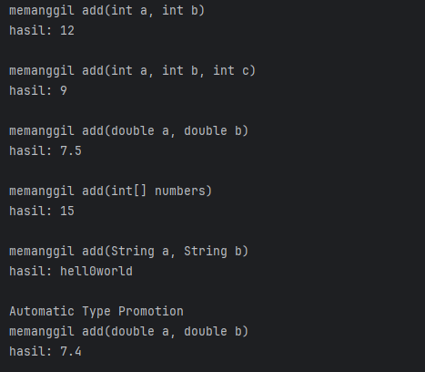
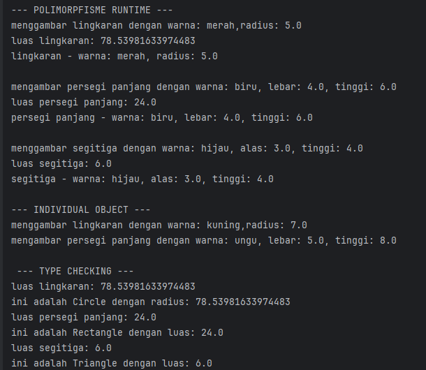

# Laporan Modul 7: Polymorphism
**Mata Kuliah:** Praktikum Pemrograman Berorientasi Objek   
**Nama:** Fathan Al Ghifari  
**NIM:** 2024573010091  
**Kelas:** TI 2A

---

## Abstrak
Dalam konteks pemrograman OOP (Object Oriented Programming), istilah polymorphism sering digunakan karena berkaitan erat dengan salah satu pilar seperti class, object, method, atau inheritance. Polymorphism adalah banyak bentuk atau bermacam-macam. Dalam istilah pemrograman, polymorphism adalah sebuah konsep di mana sebuah interface tunggal digunakan pada entitas yang berbeda-beda. Umumnya, penggunaan suatu simbol tunggal berfungsi untuk mewakili beberapa jenis tipe entitas.  

Polymorphism adalah konsep pemrograman yang berorientasi pada objek yang mengacu pada kemampuan variabel, fungsi atau objek untuk mengambil beberapa bentuk. Polymorphism adalah penggunaan salah satu item seperti fungsi, atribut, atau interface pada berbagai jenis objek yang berbeda dalam bahasa pemrograman. Dalam bahasa pemrograman yang menunjukkan polimorfisme, objek kelas miliki hierarki yang sama yang diwariskan dari kelas induk yang sama, mungkin memiliki fungsi dengan nama yang sama, tetapi dengan perilaku berbeda.

**Tujuan Polymorphism**
1. Flexibility - Memungkinkan kode yang lebih fleksibel dan mudah diperluas.
2. Code Reusability - Mengurangi duplikasi kode dengan menggunakan interface yang sama.
3. Maintainability - Memudahkan maintenance dan pengembangan fitur baru.
4. Dynamic Behavior - Perilaku objek ditentukan pada runtime
5. Interface Consistency - Konsistensi dalam penggunaan interface

**Cara Implementasi**
1. Gunakan inheritance hierarchy
2. Override method di subclass
3. Gunakan reference superclass untuk memegang objek subclass
4. Method yang dipanggil ditentukan pada runtime berdasarkan tipe aktual objek

**Jenis-jenis Polimorfisme:**
***Compile-time Polymorphism (Method Overloading)***
Method overriding terjadi ketika subclass (class anak) menyediakan implementasi spesifik untuk method yang sudah didefinisikan di superclass (class induk). Method overriding digunakan untuk mengubah atau memperluas perilaku method yang diwarisi dari superclass. Method yang di-override harus memiliki nama, parameter, dan return type yang sama dengan method di superclass.

****Aturan Method Overriding:****
* Method harus memiliki nama dan parameter yang sama dengan method di superclass.
* Return type harus sama atau subtype dari return type di superclass.
* Access modifier tidak boleh lebih restriktif daripada method di superclass (misalnya, jika method di superclass protected, method di subclass bisa protected atau public).
* Method tidak bisa di-override jika di superclass dideklarasikan sebagai final.

****Runtime Polymorphism (Method Overriding)****
Method overriding terjadi ketika subclass (class anak) menyediakan implementasi spesifik untuk method yang sudah didefinisikan di superclass (class induk). Method overriding digunakan untuk mengubah atau memperluas perilaku method yang diwarisi dari superclass. Method yang di-override harus memiliki nama, parameter, dan return type yang sama dengan method di superclass.

****Aturan Method Overriding:****
* Method harus memiliki nama dan parameter yang sama dengan method di superclass.
* Return type harus sama atau subtype dari return type di superclass.
* Access modifier tidak boleh lebih restriktif daripada method di superclass (misalnya, jika method di superclass protected, method di subclass bisa protected atau public).
* Method tidak bisa di-override jika di superclass dideklarasikan sebagai final.
---

## Pratikum 1: Memahami Method Overloading (Compile-time Polymorphism)
###### Tujuan:
Memahami konsep dan implementasi method overloading.  
1. Buat sebuah package baru di dalam package `modul_7` dengan nama `praktikum_1`
2. Buat class baru bernama `Calculator` dengan method overloading:
```declarative
package modul_7.pratikum_1;

public class Calculator {

public int add(int a, int b){
System.out.println("memanggil add(int a, int b)");
return a+b;
}

public int add(int a, int b, int c){
System.out.println("memanggil add(int a, int b, int c)");
return a + b + c;
}

public double add(double a, double b){
System.out.println("memanggil add(double a, double b)");
return a + b;
}

public int add(int[] numbers){
System.out.println("memanggil add(int[] numbers)");
int sum = 0;
for(int num : numbers){
sum += num;
}
return sum;
}

public String add(String a, String b){
System.out.println("memanggil add(String a, String b)");
return a + b;
}
}


```
3. Buat class `overloadingTest` untuk testing:
```declarative
package modul_7.pratikum_1;

public class OverloadingTest {
public static void main(String[] args){
Calculator calc = new Calculator();

System.out.println("hasil: " + calc.add(5,7));
System.out.println();

System.out.println("hasil: " + calc.add(2,3,4));
System.out.println();

System.out.println("hasil: " + calc.add(4.0,3.5));
System.out.println();

int[] numbers = {1,2,3,4,5};
System.out.println("hasil: " + calc.add(numbers));
System.out.println();

System.out.println("hasil: " + calc.add("hell0", "world"));
System.out.println();

System.out.println("Automatic Type Promotion");
System.out.println("hasil: " + calc.add(5,2.4));
}
}


```
hasil:  

---

## Praktikum 2: Memahami Method Overriding (Runtime Polymorphism)
  **Tujuan:**
  Memahami konsep runtime polymorphism melalui method overriding.

Langkah-langkah:
1. Buat sebuah package baru di dalam package `modul_7` dengan nama `praktikum_2`
2. Buat class `Shape` dengan getter dan setter lengkap
```declarative
package modul_7.pratikum_2;

public class Shape {
protected String color;

public Shape(String color){
this.color = color;
}

public void draw(){
System.out.println("menggambar shape dengan warna " + color);
}

public double calculateArea(){
System.out.println("menghitung luas umum");
return 0.0;
}

public void displayInfo(){
System.out.println("shape - warna: " + color);
}
}


```
3. Buat class `Circle` yang mewarisi Shape:
```declarative
package modul_7.pratikum_2;

public class Circle extends Shape{
private double radius;

public Circle(String color, double radius){
super(color);
this.radius = radius;
}

@Override
public void draw() {
System.out.println("menggambar lingkaran dengan warna: " + color + ",radius: " + radius);
}
public double calculateArea(){
double area = Math.PI * radius * radius;
System.out.println("luas lingkaran: " + area);
return area;
}

public void displayInfo(){
System.out.println("lingkaran - warna: " + color + ", radius: " + radius);
}
}


```

4. Buat class `Rectangle` yang mewarisi Shape:
```declarative
package modul_7.pratikum_2;

public class Rectangle extends Shape{
    private double width;
    private double height;

    public Rectangle(String color, double width, double height){
        super(color);
        this.width = width;
        this.height = height;
    }

    @Override
    public void draw(){
        System.out.println("mengambar persegi panjang dengan warna: " + color + ", lebar: " + width + ", tinggi: " + height);
    }

    public double calculateArea(){
        double area = width * height;
        System.out.println("luas persegi panjang: " + area);
        return area;
    }

    public void displayInfo(){
        System.out.println("persegi panjang - warna: " + color + ", lebar: " + width + ", tinggi: " + height);
    }
}

```

5. Buat class `Triangle` yang mewarisi Shape:
```declarative
package modul_7.pratikum_2;

public class Triangle extends Shape{
    private double base;
    private double height;

    public Triangle(String color, double base, double height){
        super(color);
        this.base = base;
        this.height = height;
    }

    @Override
    public void draw(){
        System.out.println("menggambar segitiga dengan warna: " + color + ", alas: " + base + ", tinggi: " + height);
    }

    public double calculateArea(){
        double area = 0.5 * base * height;
        System.out.println("luas segitiga: "+ area);
        return area;
    }

    public void displayInfo(){
        System.out.println("segitiga - warna: " + color + ", alas: " + base + ", tinggi: " +height);
    }
}

```

6. Buat class `PolymorphismTest` untuk testing:
```declarative
package modul_7.pratikum_2;

public class PolymorphismTest {
    public static void main(String[] args){
        Shape[] shapes = new Shape[3];
        shapes[0] = new Circle("merah", 5.0);
        shapes[1] = new Rectangle("biru",4.0,6.0);
        shapes[2] = new Triangle("hijau",3.0,4.0);

        System.out.println("--- POLIMORPFISME RUNTIME ---");
        for(Shape shape : shapes){
            shape.draw();
            shape.calculateArea();
            shape.displayInfo();
            System.out.println();
        }

        System.out.println("--- INDIVIDUAL OBJECT ---");
        Shape shape1 = new Circle("kuning",7.0);
        Shape shape2 = new Rectangle("ungu", 5.0,8.0);

        shape1.draw();
        shape2.draw();

        System.out.println("\n --- TYPE CHECKING ---");
        for(Shape shape : shapes){
            if(shape instanceof  Circle){
                Circle circle = (Circle) shape;
                System.out.println("ini adalah Circle dengan radius: " + circle.calculateArea());
            } else if(shape instanceof Rectangle){
                Rectangle rectangle = (Rectangle) shape;
                System.out.println("ini adalah Rectangle dengan luas: " + rectangle.calculateArea());
            }else if(shape instanceof Triangle){
                Triangle triangle = (Triangle) shape;
                System.out.println("ini adalah Triangle dengan luas: " + triangle.calculateArea());
            }
        }
    }
}

```
hasil:  


---

## Referensi
- https://www.w3schools.com/java
- https://www.petanikode.com/tutorial/java/

---
